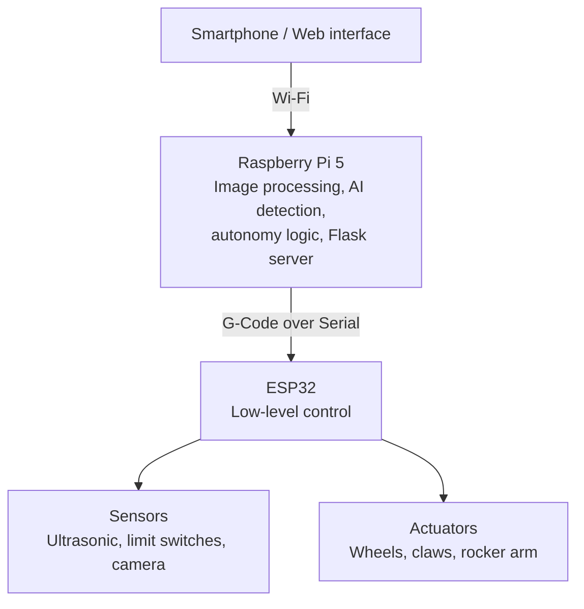

# B3-4T — Autonomous Tennis Ball Collector Robot

**Engineering internship — RIMUEL (Aix-en-Provence, France) — April to June 2025**
*ISMIN Engineering Track, Mines Saint-Étienne*

---

## Confidentiality notice

This repository documents **selected parts** of a robotics project I contributed to during a 12-week technical internship. To respect company confidentiality, the core robot design, embedded firmware, and product roadmap remain proprietary.

---

## Project context

I was developing an autonomous robot to collect tennis balls scattered on a court during training sessions with an automatic ball launcher, saving players time and avoiding repetitive bending.

The system runs on a two-layer architecture:

- A **low-level controller** (ESP32) driving motors, sensors and actuators through a custom G-Code-style serial protocol
- A **high-level controller** (Raspberry Pi 5) handling image processing, AI-based ball detection, autonomy logic, and communication with a smartphone over a Wi-Fi hotspot

I joined as a software engineering intern. My responsibilities included stabilizing the existing embedded firmware, building the Raspberry Pi decision layer from scratch, and integrating an AI-based ball detection system — the last two of which are covered in this repository.


*Simplified, generic representation of the architecture — exact command sets, error handling logic and mechanical details are not reproduced.*

---

## Repository contents

```
├── flask_server/       → Python command server (Flask)
├── ai_training/        → AI ball-detection training pipeline & results
├── demo/               → Photos: hardware setup, RPi5 config, detection results
└── README.md
```

---

## 1. Raspberry Pi 5 — Linux environment setup

Because an AI vision model was planned for the high-level layer, we chose the most capable Raspberry Pi model available at the time to avoid hardware bottlenecks. Setting up a headless, remotely-accessible Linux environment was the foundation for everything built afterward (serial communication with the ESP32, the Flask server, and the AI pipeline).

**Requirements**
- [Raspberry Pi Imager](https://www.raspberrypi.com/software/)
- [Nmap](https://nmap.org/) — to find the Pi's IP address on the local network
- [PuTTY](https://www.putty.org/) — SSH client
- [VcXsrv](https://sourceforge.net/projects/vcxsrv/) — X server, for forwarding graphical applications over SSH

**Steps**

1. **Flash the SD card**
   Open Raspberry Pi Imager, select **Raspberry Pi OS (64-bit)**, choose the target SD card, then in the advanced options:
   - set a username / password
   - configure Wi-Fi credentials (SSID + password), or leave blank for an Ethernet-only setup
   - set a hostname (e.g. `b34t`)

2. **Enable SSH before first boot**
   On the SD card's `boot` partition, create an empty text file named `ssh` (no extension). This enables the SSH server on first startup without needing a monitor/keyboard.

3. **Boot the Pi**
   Insert the SD card, connect the Pi to the network over Ethernet if needed, and power it on (first boot takes about 30 seconds).

4. **Find the Pi's IP address**
   ```bash
   # Identify your gateway
   arp -a

   # Scan the local subnet for the Pi
   nmap -sn 192.168.0.0/24
   ```
   Look for the device identified as "Raspberry Pi Foundation" in the scan results.

5. **Connect with X11 forwarding**
   Launch **VcXsrv** (it runs minimized in the system tray once ready), then open **PuTTY**:
   - **Session** → Host Name: the Pi's IP address
   - **Connection → SSH → X11** → check **Enable X11 forwarding**
   - back in **Session**, name and save the profile, then click **Open**
   - accept the host key warning and log in with the credentials set in step 1

   X11 forwarding made it possible to run and debug graphical tools (e.g. camera preview windows) directly from the remote session — useful for calibrating the camera without physically connecting a monitor to the robot.

---

## 2. Flask command server (Python)

The Raspberry Pi runs a lightweight **Flask** server that acts as the bridge between the outside world and the robot's low-level controller:

- exposes simple HTTP endpoints that a smartphone (connected to the Pi's own Wi-Fi hotspot) can call to send commands
- translates high-level requests into the G-Code-style serial protocol understood by the ESP32
- keeps the command surface intentionally minimal — for example, sending a single short instruction to move forward, rather than exposing low-level motor power distribution to the client

This design let the smartphone interface stay decoupled from the embedded logic: as long as the G-Code protocol on the ESP32 side stayed stable, the Flask layer and the client app could evolve independently.

The command server implementation is in [`flask_server/`](./flask_server).

---

## 3. AI ball-detection training pipeline

**Goal:** detect tennis balls on the ground from an onboard camera feed, meeting the following requirements:
- ≥ 90% detection precision
- zero false positives
- ability to estimate ball density in a given zone
- real-time performance ≥ 1 FPS on-device (Raspberry Pi 5)

**Approach**

Two approaches were evaluated:

1. **Classical image processing (Python/OpenCV-style pipeline):** detect yellow pixel clusters, then filter for circular shapes. Fast (well above 1 FPS) and cheap to run, but not robust to lighting and shadow variation — it fell short of the precision target, though it was valuable for validating camera placement and optical settings early on.

2. **Trained object-detection model (Roboflow):** a dataset was built and a detection model trained and exported directly to the Raspberry Pi. Reduced-scale ball targets (small marbles standing in for full-size tennis balls) were used to validate the training loop quickly and safely before scaling to real balls.

**Training results**

| Metric | Result |
|---|---|
| mAP | ~0.93 |
| mAP@50:95 | ~0.65 |
| Training length | ~300 epochs |
| On-device inference | > 1 FPS on Raspberry Pi 5 |
| False positives | Eliminated via Roboflow post-processing parameters |

Box loss, class loss and object loss all converged smoothly over training — see the training curves in [`demo/training_curves`](./demo).

---

## Tech stack

`C++` (context only, not published) · `Python` · `Flask` · `Linux` (Raspberry Pi OS) · `SSH` / `X11 forwarding` · `Wi-Fi hotspot networking` · `Roboflow` (computer vision / object detection) · `Serial communication` / `G-Code protocol`

## Skills demonstrated

- Linux system setup and remote administration on embedded hardware
- REST API design with Flask, bridging a network client to an embedded serial protocol
- Applied computer vision: dataset preparation, model training, and evaluation against a concrete requirements spec
- Technical documentation for handover in a small, resource-constrained team
- Autonomous execution in a startup environment, alongside a hardware/mechanical lead

---
